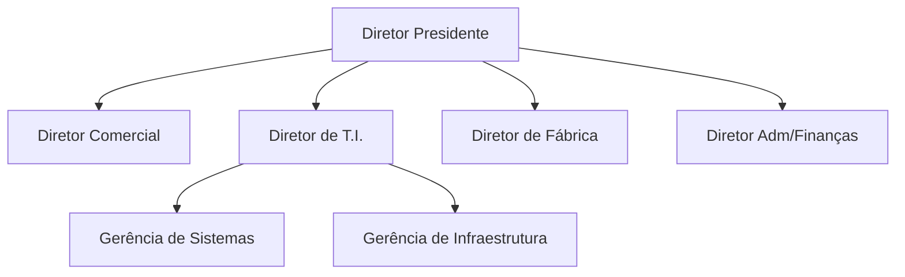

# Estudo de Caso 01

Parte 1: Descrever as atribuições das novas funções de Administração de Dados,
Administração de Banco de Dados e Administração de Aplicações e posicioná-las
na estrutura organizacional da CETAF, justificando o posicionamento proposto.

Com base na nova hierarquia, a classificação dos diretores com os papeies de Banco de dados não entra em caso devido ao fato de que diretores não
participam do desenvolvimento de um software e apenas cuidam do negócio. Logo, a classificação de papeis sera no nível gerencial, onde, o Gerenciador
de Sistemas tem os papeis A.A e D.A devido ao fato de que ele sera responsável por apresentar o sistema como um todo nas reportagens ao seu superior
que é o Diretor de TI enquanto o Gerenciador de Infraestrutura terá o papel de D.B.A pois sua preocupação é exatamente a infraestrutura de operação do
sistema com foco em performance. Ao fim, ambas as gerências terão que apresentar algo ao nivel superior.
